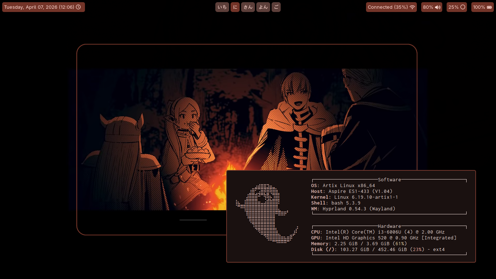

<h1 align="center">Hyprcozy</h1>



# Installation
```
git clone https://github.com/esperime/hyprcozy.git
cd hyprcozy
./install.sh
```

# Usage
`SUPER + ENTER` - Launch Terminal emulator

`SUPER + D` - Launch Fuzzel

`SUPER + E` - Open file manager

`SUPER + Q` - Quit / Exit

`SUPER + L` - Lock screen

`PRINT` - Capture a window

`SHIFT + PRINT` - Capture fullscreen

`SUPER + PRINT` - Capture a region
